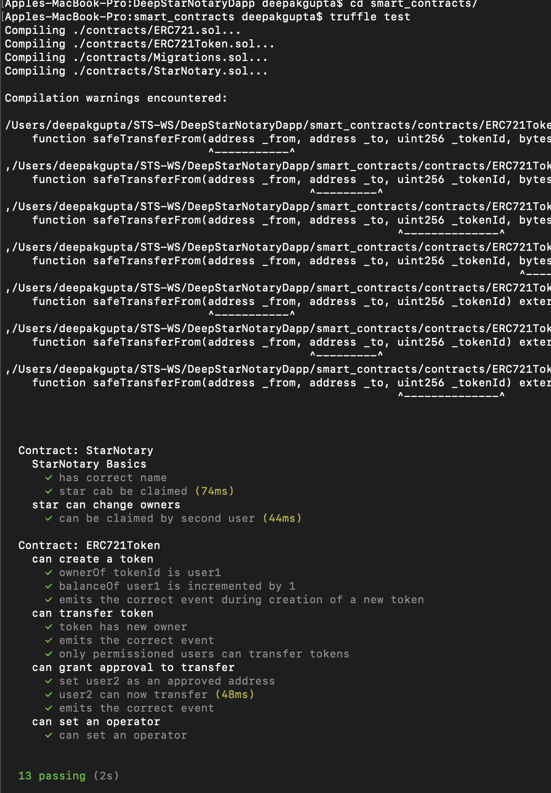
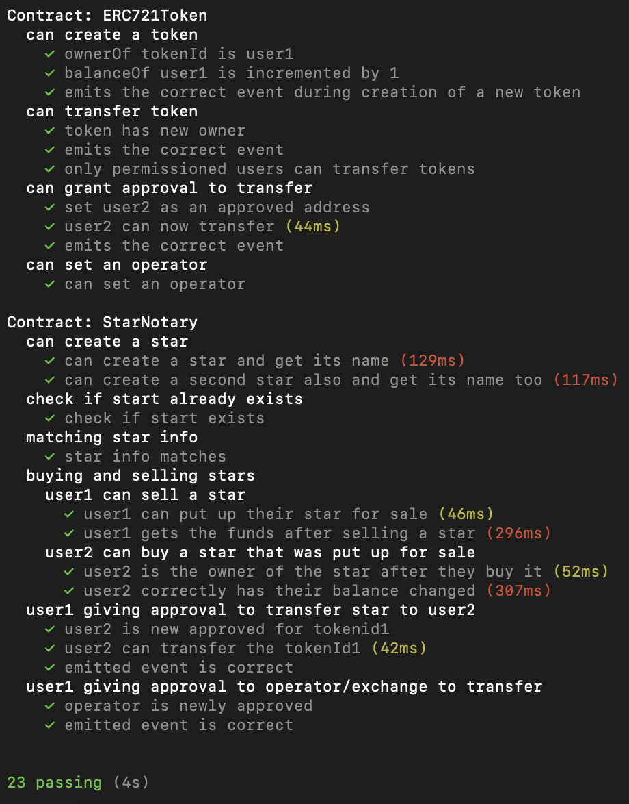
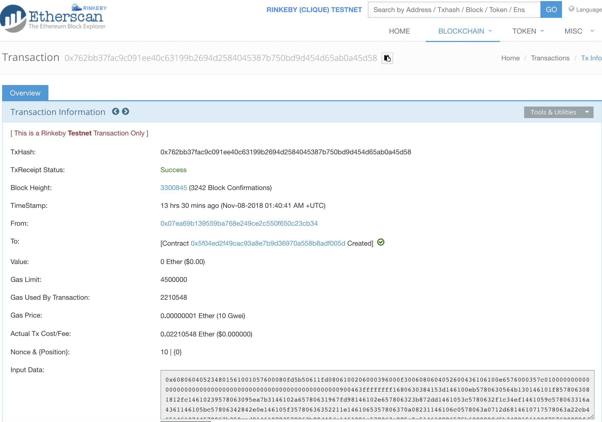
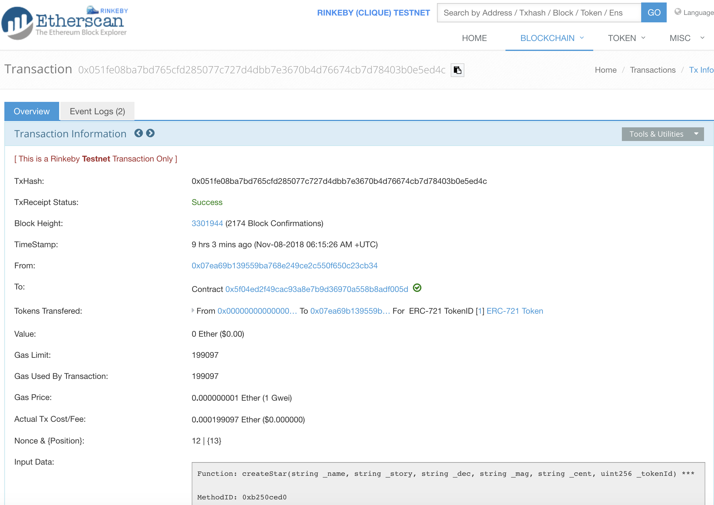
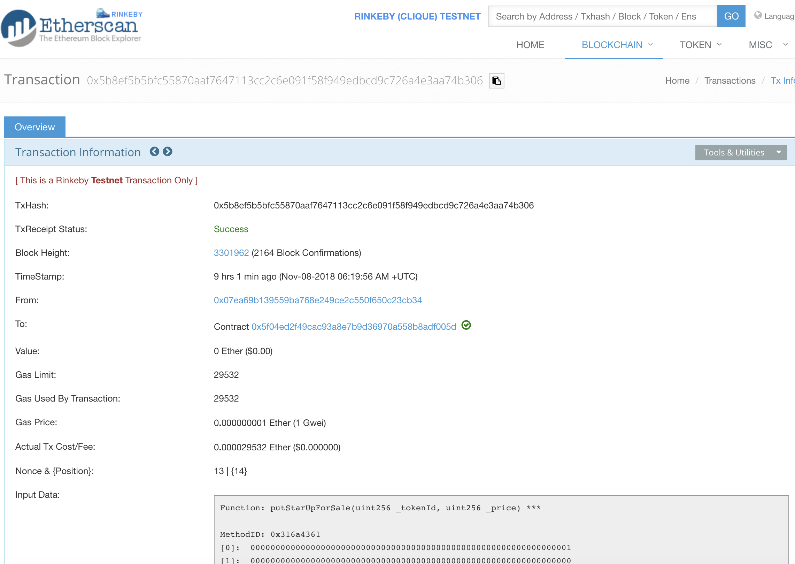

# DeepStarNotaryDapp
## Remix-Ganache-Metamask
Remix - Develop smart contract on Remix(In Browser UI) <br>
Ganache - "The Ethereum Blockchain" <br>
Metamask - Chrome plugin to talk to Ganache.
### Steps -
1) Start Ganache - The Blockchain , This blockchain comes with 10 account with some ether already assigned. 
    Ganache runs RPC Server at HTTP://127.0.0.1:7545 providing services to interact and manipulate the blockchain.
2) Start Metamask - Connect to Ganache using MNEMONIC from Ganache. 
3) Remix - Develop smart contract "StarNotary.sol" using Remix. Configure web3 Provider as Ganache RPC Server, Deploy your smart contract.
4) Index.html -
Use web3 from metamask injected.
``` 
            if(typeof web3 != 'undefined') { 
                web3 = new Web3(web3.currentProvider) // what Metamask injected 
            } else {
                // Instantiate and set Ganache as your provider
                //running it thru ui
                web3 = new Web3(new Web3.providers.HttpProvider("http://localhost:7545"));
            }
```
Copy deployed smart contract address from Remix console - 
```
            var starNotary = StarNotary.at('0xe0b7d855180ede9d4490552f5a63e06fe96cfa7b');
```
5) Install http-server using npm
```
npm install -g http-server
```
6) Change directory to where index.html is there.
```
http-server
```
By default index.html is run at http://127.0.0.1:8080
Use above to launch your star notary to display star, owner and button to claim star.

## Unit testing with Truffle - Javascript - Solidity
1) install truffle globally - 
```
npm install -global truffle
```
2) change directory to your project folder 
```
mkdir smart_contracts
cd smart_contracts
truffle init
```
3) Above creates 3 new directories in smart_contracts folder <br>
   a) contracts
   b) test
   c) migrations and 2 files "truffle-config.js" and "truffle.js" <br>
4) Move StarNotary.sol contract created using Remix to "contracts" folder
5) Create StarNotaryTest.js file with unit tests in "tests" directory.
6) Command to run unit tests (from smart_contracts directory)
```
truffle test
```
 
 ## ERC721 interface and its implementation via ERC721Token
 ERC721 inteface is standard interface for implementing NFT ( non fungible token) like registry etc.<br>
 ERC721Token is ERC721 interface implementation as per our requirement of Star Notary.<br>
 Unit tests of the above ERC721Token are covered in ERC721TokenTest.js . <br>
 Below is the test report of above unit tests run using truffle.<br>


## Star Notary contract code coverage
Below is the code coverage report of unit tests run using truffle.<br>


## Truffle - Infura - Rinkeby (Deploying Smart Contract on Rinkeby public test network)
1) change directory to your smart_contracts folder and install truffle hdwallet
```
npm install truffle-hdwallet-provider
```
2) Set up account on Infura and create project copy RINKEBY network endpoin address something like this - 
https://rinkeby.infura.io/v3/360d3b276f5d4b78969708a8dde0d710

3) Start Ganache and grab the mnemonics 
4) Compile your smart contract - This will generate json files having ABIs etc.
```
truffle compile
```
5) Configure truffle.js as below 
```
var HDWalletProvider = require('truffle-hdwallet-provider');

var mnemonic = 'wait worry size million cable awesome auto erode frog either rail notice';

module.exports = {
  networks: { 
    development: {
      host: '127.0.0.1',
      port: 7545,
      network_id: "*"
    }, 
    rinkeby: {
      provider: function() { 
        return new HDWalletProvider(mnemonic, 'https://rinkeby.infura.io/v3/360d3b276f5d4b78969708a8dde0d710') 
      },
      network_id: 4,
      gas: 4500000,
      gasPrice: 10000000000,
    }
  }
};
```
6) Change directory to migrations folder <br>
    create file 2_star_notary.js as below mentioning "StarNotary" contract name to be deployed.
    ```
    var Migrations = artifacts.require("StarNotary");

    module.exports = function(deployer) {
      deployer.deploy(Migrations);
    };
    ```
7) Deploy to Infura
```
truffle migrate
```

## Contract is now deployed and details from etherscan.io are - 
Transaction Hash - 0x762bb37fac9c091ee40c63199b2694d2584045387b750bd9d454d65ab0a45d58 <br>
Contract Address - 0x5f04ed2f49cac93a8e7b9d36970a558b8adf005d



### Execute createStar (Using myehterwllet)
Transaction Hash - 0x051fe08ba7bd765cfd285077c727d4dbb7e3670b4d76674cb7d78403b0e5ed4c <br>
Token Id - 1


### Execute PutStarUpForSale (Using myehterwllet)
Transaction Hash - 0x5b8ef5b5bfc55870aaf7647113cc2c6e091f58f949edbcd9c726a4e3aa74b306 <br>



 
 


